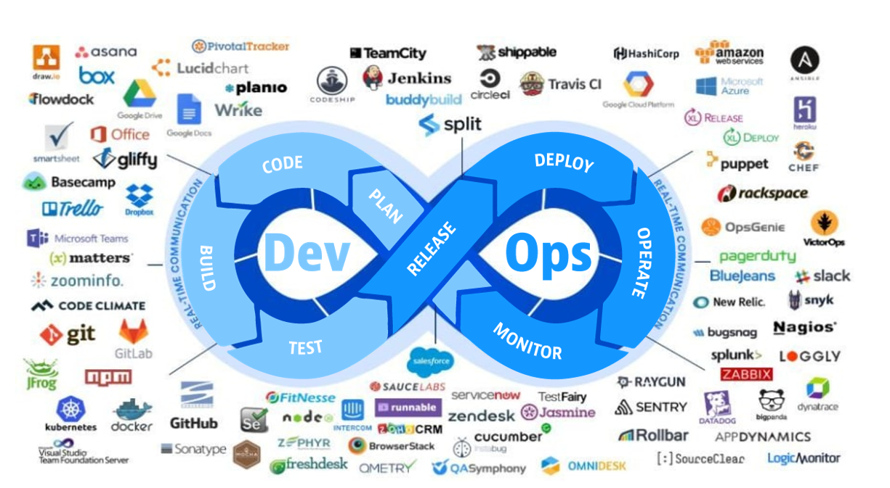

I just watched the highlights from the 2022 Red Bull Rampage and can see a few analogies with what the riders are doing and what we do as Cloud DevOps Engineers

## Choose your line

Which part of the line will you take?

## More from me

Check out my [LinkedIn profile][linkedin-profile] for more info about me and my career, as well as my [GitHub][github-profile], where you'll find the personal projects I've been working on.

If you have questions, feel free to drop me a message.

[linkedin-profile]: https://www.linkedin.com/in/robertbogan/
[github-profile]:   https://github.com/robert-bogan
